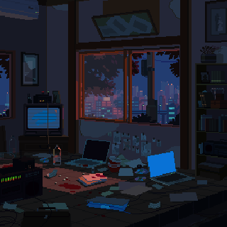

<h1 align="center">
code, tea, music, commit, repeat.
</h1>
<br/>
<!-- <p align="center">
  
</p> -->


<hr>

```
jakhongirav@github
-------------------------
 I am a Software engineer
 I have a strong interest in Linux and Artificial Intelligence
 Working on Frontend and Backend development
 Learning about Backend and IOS development
 Main languages: JavaScript, TypeScript
 Interested in Full Stack Web and Mobile development
```
<hr>

### ✍️ Random Dev Quote


---
[](https://visitcount.itsvg.in)

